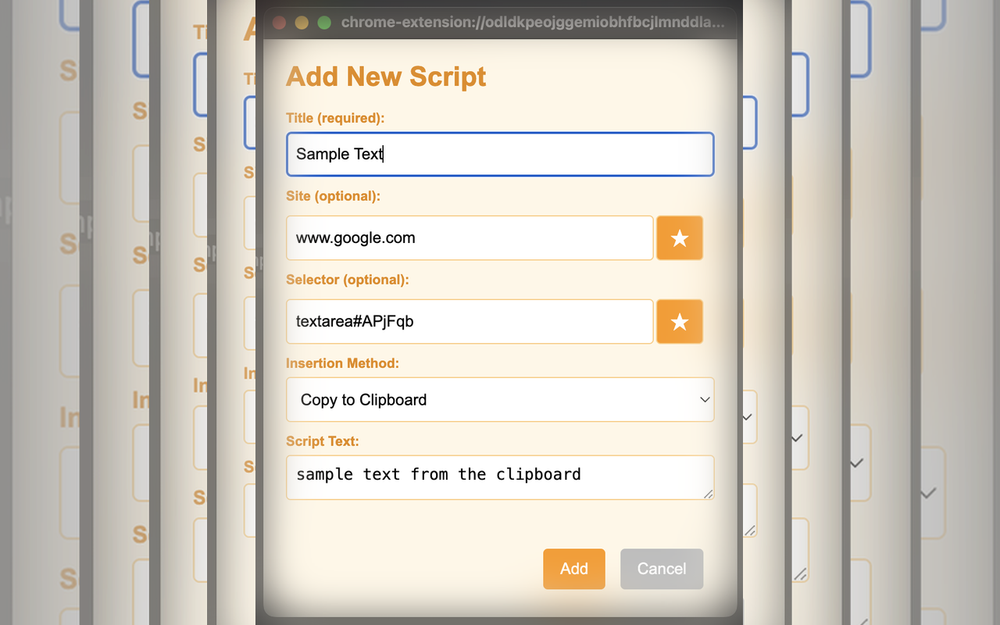

# TextNugs Text snippets Chrome Extension

<table><tr><td width = "200px">
</td>
<td>TextNugs is a Chrome extension that allows you to store and insert commonly used scripts or text snippets into web pages. It provides a convenient way to manage your scripts and quickly insert them into browser pages, targeted to different web sites or text edit fields on the page if needed.</td></tr>
</table>

- [Releases](./releases//RELEASE.md)

<table>
  <tr>
    <td width="25%">
      
    </td>
    <td width="25%">
      
    </td>
    <td width="25%">
      
    </td>
        <td width="25%">
      
    </td>
  </tr>
</table>

## Features

- **Add New Scripts**: Save scripts with a title, optional site, optional selector, and choose the insertion method.
- **Edit and Manage Scripts**: View, edit, clone, or delete all your saved scripts in one place.
- **Clone Scripts**: Easily duplicate existing scripts to create variations without starting from scratch.
- **Dynamic Clipboard Insertion**: Use `{{clipboard}}` in your scripts to insert the current clipboard content dynamically in context.
- **Quick Access**: Access your scripts directly from the extension popup and insert them into web pages.
- **Insertion Methods**:
  - **Direct Insertion**: Attempts to insert the script directly at the cursor position in the active element or the element specified when setting up the script.
  - **Copy to Clipboard**: Copies the script to the clipboard for manual pasting.
- **Backup, Restore, and Import**:
  - **Backup**: Save all your scripts and settings to a JSON file for safekeeping.
  - **Restore**: Replace all current scripts with a previous backup.
  - **Import**: Merge scripts from a backup into your current set.
  - **Clear All Scripts**: Remove all stored scripts (useful for GDPR compliance).
  - **Restore / Import from File or URL** - You can either specify a local file on your computer, or you can specify a URL if you or someone else have put a collection of snippets on an internet site somewhere that is accessible to your browser. Exercise caution and ensure you trust the source of the file to make sure someone does not provide a malicious file.
- Clickable popover for menu items so you can use snippets for quick references, or quickly copy bits of the snippet

## Installation

### User

1. Search for 'TextNugs' on the [chrome web store](https://chromewebstore.google.com/)
1. Download from the chrome web store

### Developer

1. **Download or Clone the Repository**: Obtain the extension files on your local machine.
2. **Load the Extension into Chrome**:
   - Open `chrome://extensions/` in your Chrome browser.
   - Enable **Developer mode** by toggling the switch in the top right corner.
   - Click **Load unpacked** and select the folder containing the extension files.
3. **Permissions**: The extension requires permissions to access all websites (`<all_urls>`), read and write to the clipboard, and access active tabs.

## Usage

### Adding a New Script

1. **Open the Extension**: Click on the TextNugs icon in the Chrome toolbar.
2. **Add a Script**: Click the **Add...** button to open the **Add New Script** dialog.
3. **Fill in the Details**:
   - **Title** (required): A descriptive name for your script.
   - **Site** (optional): Specify a site or use wildcards (e.g., `*.example.com`).
     - If you want the script to be usable from any site, click the star button to the right of the text field to fill the field with a star to represent 'all sites'. This will be defaulted to the host name of the site you were on when you clicked this **Add...*** button.
   - **Selector** (optional): A CSS selector to target a specific element on the page.
     - If you want the script to be usable from anywhere on the page, click the star button to the right of the text field to fill the field with a star to represent 'anywhere on the page'. If you were clicked on an edit box on the page this will be used by default if possible
   - **Insertion Method**:
     - **Direct Insertion**: Inserts the script directly into the page.
     - **Copy to Clipboard**: Copies the script to the clipboard.
   - **Script Text**: Enter the script or text snippet you want to save.
4. **Save the Script**: Click **Add** to save the script.

### Editing and Cloning Scripts

1. **Open the Extension**: Click on the TextNugs icon.
2. **Edit All Scripts**: Click the **Edit All** button to open the **Edit All Scripts** dialog.
3. **Modify Scripts**:
   - Click on a script title to expand and edit its details.
   - Make changes to the title, site, selector, insertion method, or script text.
   - Reset the site or selector to a * for 'any' with the star button, or set to the currently selected page / selected text editor field's selector with the refresh button.
4. **Clone Scripts**:
   - Click the **Clone** button next to a script to create a duplicate.
   - A cloned script will appear with the same details, which you can then modify as needed.
5. **Delete Scripts**: Click the **Delete** button within a script to remove it.
6. **Save Changes**: Click **Update** to save all modifications.

### Inserting Scripts into Web Pages

1. **Navigate to a Web Page**: Go to the website where you want to insert the script.
2. **Focus on the Target Element**:
   - If you've specified a selector, the extension will target that element.
   - If no selector is specified, click inside the input field or editable area where you want to insert the script.
3. **Open the Extension**: Click on the TextNugs icon.
4. **Select a Script**: Click on the script you want to insert.
5. **Insertion Method**:
   - **Direct Insertion**:
     - The script will be inserted at the cursor position.
     - If text is highlighted, it will be replaced.
   - **Copy to Clipboard**:
     - The script is copied to your clipboard.
     - Manually paste (`Ctrl+V` or `Cmd+V` on a Mac or right-click and select "Paste") into the target field.

## Backup, Restore, and Import

### Backup

The **Backup** feature allows you to save all your scripts and settings to a JSON file for safekeeping. You can use this to create backups, share scripts between devices or colleagues, or store different collections of scripts for various use cases.

- Click the **Backup** button to download a file named `paste-hoarder-<timestamp>.json`.
- Alternatively, type A URL from which you can download a set of snippets / scripts - make sure you trust this source. E.g. some sample collections in the repository are:
  - `https://raw.githubusercontent.com/storizzi/textnugs-chrome/refs/heads/main/samples/javascript-snippets.json`
  - `https://raw.githubusercontent.com/storizzi/textnugs-chrome/refs/heads/main/samples/llm-snippets.json`
- The file contains metadata, settings, and all stored scripts.

### Restore

The **Restore** feature replaces all existing scripts with the ones from a backup file. This is useful when you want to restore a previous backup or move scripts between devices.

- Click **Choose File** to select a backup JSON file.
- Click **Restore** to replace all existing scripts with those from the file.
- A confirmation dialog will appear before proceeding to prevent accidental replacement.

### Import

The **Import** feature merges scripts from a backup JSON file with your existing scripts. Use this to combine collections or add scripts from another machine or colleague without overwriting your current scripts.

- Click **Choose File** to select a backup JSON file.
- Click **Import** to merge the scripts from the file into your current set.
- A confirmation dialog will appear before proceeding.

There are samples in the plugin directory under the 'samples' folder that can be imported as examples if you wish to test this functionality without having to create a load of snippets first:

- `javascript-snippets.json` - Example JavaScript snippets
- `llm-snippets.json` - Example LLM prompt snippets

### Clear All Scripts

The **Clear All Scripts** feature removes all stored scripts from your browser. This is useful for GDPR compliance or when you want to reset the extension. After clearing, you can import or restore scripts from a backup.

- Click **Clear All Scripts** to delete all scripts.
- A confirmation dialog will appear to confirm the action.

### Use Cases

- **Backup for Safekeeping**: Regularly back up your scripts to ensure you don’t lose important snippets.
- **Share with Friends/Colleagues**: Export your snippets and share the JSON file with others for collaboration.
- **Transfer Between Devices**: Use backups to transfer scripts between different devices or browsers.
- **Different Collections**: Store different types of scripts (e.g., development, communication) in separate backups to switch between them as needed.

## Statistics Section

At the bottom of the settings page, a **Statistics** section displays the following information:
- **Number of Scripts**: The total number of scripts stored.
- **Size of Scripts Storage**: The amount of storage space used by the scripts.
- **Space Left**: How much space remains in the Chrome extension storage.
- **Approximate Scripts Remaining**: An estimate of how many more scripts you can store based on the average script size.

### Scrollable Settings Popup

If the statistics section is not visible on smaller screens, you can scroll down within the settings popup to view the full content. The settings popup is designed to be fully scrollable.

## Dynamic Clipboard Insertion with `{{clipboard}}`

The extension supports replacing the `{{clipboard}}` placeholder in your script text with the current clipboard content before insertion.

### How to Use `{{clipboard}}`:

- **Include `{{clipboard}}` in your Script Text**:
  - When adding or editing a script, insert `{{clipboard}}` where you want the clipboard content to appear.
  - Example:
    '''
    The copied text is: {{clipboard}}
    '''
- **Permissions**:
  - The extension requires permission to read from the clipboard.
  - You may be prompted to grant this permission the first time you use this feature.

### Examples:

#### Example 1: Using `{{clipboard}}` with Direct Insertion

1. **Copy Text to Clipboard**:
   - Copy the text "Project Plan" to your clipboard.
2. **Create a Script**:
   - **Title**: "Insert Clipboard Content"
   - **Script Text**:
     '''
     Please review the following document: {{clipboard}}
     '''
   - **Insertion Method**: Direct Insertion
3. **Insert the Script**:
   - Focus on the desired input field.
   - Use the extension to insert the script.
   - **Result**:
     '''
     Please review the following document: Project Plan
     '''

#### Example 2: Using `{{clipboard}}` with Copy to Clipboard

1. **Copy Text to Clipboard**:
   - Copy the URL "https://example.com/report" to your clipboard.
2. **Create a Script**:
   - **Title**: "Share Report Link"
   - **Script Text**:
     '''
     Here is the report link: {{clipboard}}
     '''
   - **Insertion Method**: Copy to Clipboard
3. **Use the Script**:
   - Select the script from the extension.
   - The processed text is copied to your clipboard.
   - **Resulting Clipboard Content**:
     '''
     Here is the report link: https://example.com/report
     '''
   - Paste the content into any desired location.

## Cloning Scripts

The cloning feature allows you to duplicate existing scripts, making it easy to create variations without starting from scratch.

### How to Clone a Script:

1. **Open the Extension**: Click on the TextNugs icon.
2. **Edit All Scripts**: Click the **Edit All** button.
3. **Clone a Script**:
   - In the expanded view of a script, click the **Clone** button.
   - A new script with the same details will appear.
4. **Modify the Cloned Script**:
   - Edit the title, script text, or any other details as needed.
   - This is useful for creating similar scripts with slight differences.
5. **Save Changes**: Click **Update** to save all modifications.

## Wildcards for Site Matching

The **Site** field allows you to specify which websites a script is applicable to. You can use wildcards (`*`) to match multiple domains.

### Examples:

- `*`: Matches all sites.
- `*.example.com`: Matches all subdomains of `example.com` (e.g., `www.example.com`, `blog.example.com`).
- `example.com`: Matches exactly `example.com`.
- `*example*`: Matches any domain containing `example`.

**Note**: If the current site's hostname matches the pattern specified in the **Site** field, the script will be available in the extension popup.

## Understanding the Selector

The **Selector** field allows you to specify a CSS selector to target a specific element on the page. This is useful when you want the script to interact with a particular input field or editable area.

### How It Works:

- **Specified Selector**:
  - The extension will attempt to find the element matching the selector.
  - If found and focused, the script is inserted at the cursor position.
  - If not focused, the extension will focus on the element and insert the script at the end.
- **No Selector or Wildcard (`*`)**:
  - The extension uses the currently active element (the one you're focused on).
  - If the active element is editable, the script is inserted at the cursor position.

### Examples of Selectors:

- `#username`: An element with the ID `username`.
- `.comment-input`: Elements with the class `comment-input`.
- `textarea[name="message"]`: A `<textarea>` element with the name attribute `message`.
- `div.content > p:nth-of-type(2)`: The second `
` element inside a `
` with the class `content`.

**Tip**: Use unique selectors to target specific elements accurately, or make sure you are clicked into the edit field you want to use before adding a script snippet or editing a script snippet (use the refresh button next to the selector for any scripts you want this to apply to)

## Insertion Methods

### Direct Insertion

- **Functionality**: The extension attempts to insert the script directly into the web page.
- **Usage**:
  - Ideal for standard input fields, textareas, or content-editable elements.
  - Inserts at the cursor position or replaces highlighted text.
- **Limitations**:
  - May not work on complex web editors or sites with strict security policies.
  - Cannot interact with elements that do not allow programmatic text insertion.
- **With `{{clipboard}}`**:
  - The `{{clipboard}}` placeholder is replaced before insertion.
  - Requires clipboard read permission.

### Copy to Clipboard

- **Functionality**: Copies the script text to your clipboard.
- **Usage**:
  - Universal method that works on all websites.
  - Requires manual pasting into the target field.
- **Advantages**:
  - Bypasses limitations of direct insertion.
  - Ensures the script text is available for insertion anywhere.
- **With `{{clipboard}}`**:
  - The `{{clipboard}}` placeholder is replaced before copying.
  - Clipboard contains the processed text.

## Tips and Best Practices

- **Specify Sites When Relevant**: Limit scripts to specific sites to keep your extension popup organized.
- **Use Descriptive Titles**: Make it easier to find and select the right script.
- **Test Selectors**: Ensure your selectors accurately target the desired elements. You can test them in the browser console using `document.querySelector('your-selector')`.
- **Fallback to Clipboard**: If direct insertion doesn't work on a particular site, consider using the copy to clipboard method.
- **Utilize Cloning**: Clone scripts to create new versions without re-entering all details.
- **Leverage `{{clipboard}}`**: Use the clipboard placeholder to insert dynamic content.

## Troubleshooting

- **Script Not Inserting**:
  - Ensure the target element is editable.
  - Verify that the selector correctly identifies the element.
  - Check if the site has security policies preventing script insertion.
- **Copy to Clipboard Fails**:
  - Ensure the extension has the necessary clipboard permissions.
  - Try reloading the extension and Chrome browser.
- **Script Not Appearing in Popup**:
  - Confirm that the current site matches the pattern in the **Site** field.
  - Wildcards can be used to broaden the match.
- **`{{clipboard}}` Not Replaced**:
  - Ensure you've granted clipboard read permissions.
  - Verify that the clipboard contains the expected content.

## Contributing

Contributions are welcome! If you have suggestions for improvements or new features, feel free to submit a pull request or open an issue.

## License

This project is licensed under the MIT License.

---

Thank you for using the TextNugs Chrome Extension! If you encounter any issues or have questions, please don't hesitate to reach out.
